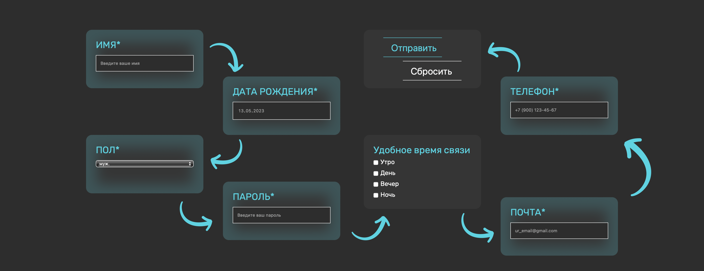
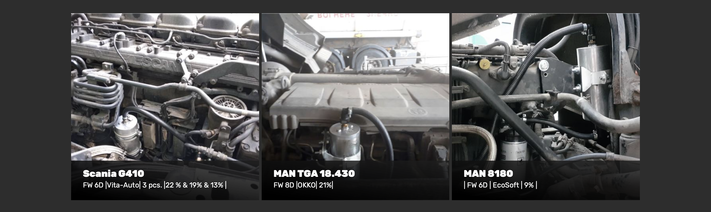
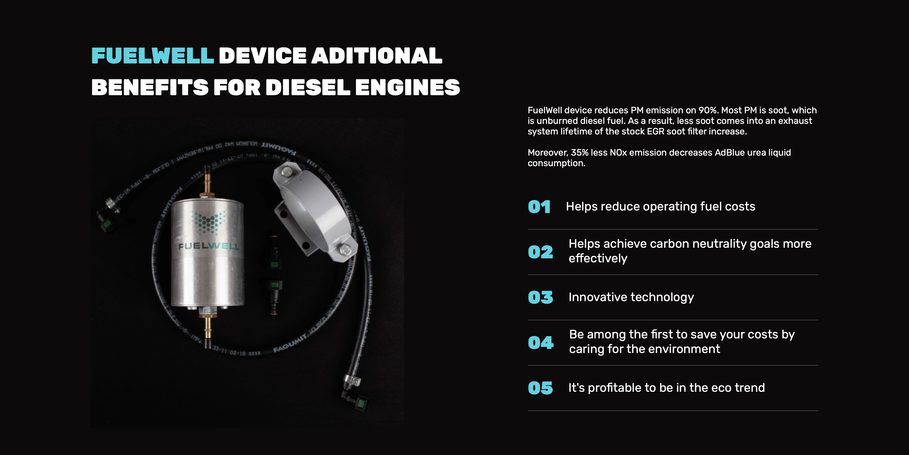

# Лабораторная работа №1
## Описания человека с помощью BEM
```
.human>.human__head.head+.human__body.body>.human__arms.arms>arms__left>arms__left--tatto^^arms__right>arms__right--fingers.fingers>fingers--ring^^^^^.human__legs.legs
```
## Блоки из макета
### Header
```
header.header>div.header__wrapper>a.heaedrer__logo.logo>img.logo__image+nav.header__navigation.navigation>ul.navigation__list>(li.navigation__item>a.navigation__link)*8
```


### Form
```
form.registration__form>(div.registration__wrapper>img.registration__image*7+div.registration__content-wrapper>(label.registration__label>input.registration__input)*2+(label.registration__label>select.registration__selecr>option.registration__option*2)+label.registration__label.registration__label-current>input.registration__input)+div.registration__content-wrapper>div.button__wrapper>(button.registration__button+button.registration__button.registration__button__curret)+(label.registration__label.registration__label-current>input.registration__input)+(ul.registration__list>p.registration__text+(li.registration__item>input.registration__checkbox+span.registration__span)*4)+label.registration__label.registration__label-current>input.registration__input
```


### Karto4ka
```
ul.consumption__list>(li.consumption__item>img.consumption__image+div.consumption__description-block>h3.consumption__subheading+p.consumption__text)*3
```


### Random
```
 section.diesel>div.diesel__wrapper>(div>(h2.dieles__heading>span.txt-blue)+img.diesel__example)+div.diesel__content>p.diesel__text+ol.diesel__list>(li.diesel__item>span.diesel__item-numeric.txt-blue>p.diesel__item-text.diesel__item-pad)*5
```
